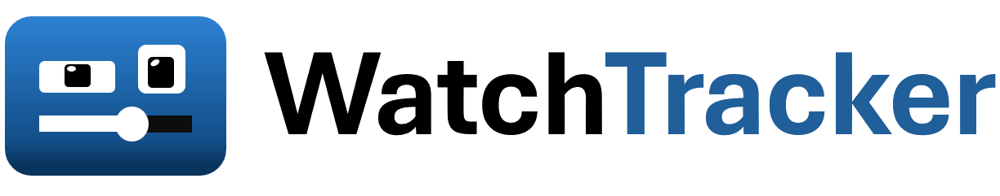

# WatchTrack

WatchTrack ist eine Web-App zum Verwalten und Tracken von Filmen und Serien. Titel lassen sich über die TMDB API suchen und einer persönlichen Bibliothek hinzufügen. Dort können Nutzer ihren Sehfortschritt pflegen, Bewertungen und Notizen hinterlegen und ausgewählte Einträge in einem öffentlichen Profil teilen. Ein Admin-Dashboard bietet zusätzliche Verwaltungsfunktionen für Nutzer und Medieneinträge.

## Voraussetzungen

- Node.js 18 oder neuer
- Ein API-Schlüssel für die [TMDB API](https://developer.themoviedb.org/docs/getting-started)

## Lokal starten

1. Repository klonen und in den Projektordner wechseln:

   ```sh
   git clone https://github.com/yazan1kasem/WatchTracker.git
   cd WatchTracker
   ```
2. Abhängigkeiten installieren:

   ```sh
   npm install
   ```
3. Die Beispielkonfiguration kopieren:

   ```sh
   # Windows PowerShell
   Copy-Item .env.example .env
   ```
   Öffne `.env` und setze mindestens:

   - `TMDB_API_KEY`: deinen TMDB API-Schlüssel
   - `JWT_SECRET`: einen eigenen, zufälligen geheimen Wert

   Die übrigen Entwicklungswerte in der Beispieldatei reichen für einen lokalen Start aus. Optional kannst du `ADMIN_USERNAME` und `ADMIN_PASSWORD` setzen, um beim Initialisieren der Datenbank ein Administratorkonto anzulegen. Für dieses Konto gelten dieselben Regeln wie bei der Registrierung (Passwort mindestens 8 Zeichen), sonst bricht `npm run db:init` mit einer Fehlermeldung ab. Setze diese Werte vor dem nächsten Schritt.
4. Datenbank und Schema initialisieren:

   ```sh
   npm run db:init
   ```
5. Entwicklungsserver starten:

   ```sh
   npm run dev
   ```
   Öffne anschließend [http://localhost:3000](http://localhost:3000). Mit `npm start` kannst du den Server ohne automatischen Neustart starten.
